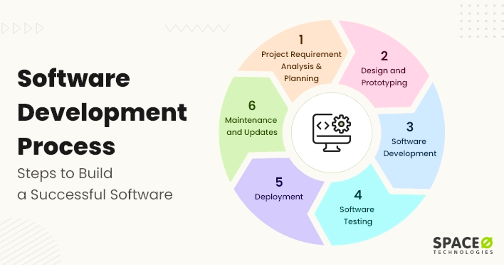
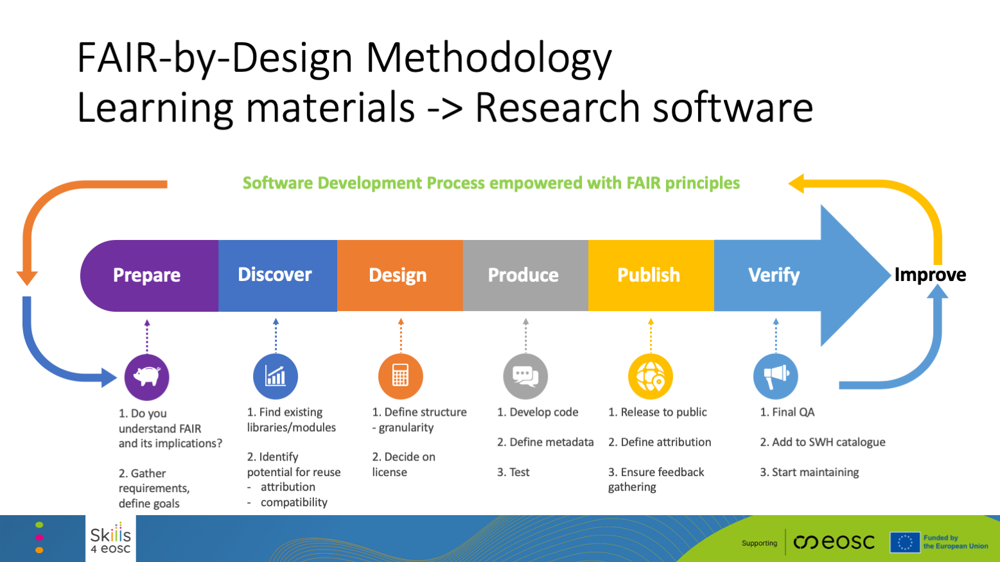

# Slides

[Download the slides regarding the FAIR-by-Design Methodology here](./Skills4EOSC-IDCCworkshop_FAIR-by-Design_Methodology.pptx){:download}

# Introduction

The FAIR-by-Design Methodology for developing learning materials has been introduced by Skills4EOSC aiming to provide a comprehensive way of developing FAIR learning materials where the necessary FAIR elements are embedded in the materials design process. In this way the methodology guarantees that the produced materials will be FAIR not just from the point of view of the learners, but also other designers and trainers that would like to reuse and adapt the materials for their own purposes. 

The premises embedded in the FAIR-by-Design methodology are transcending the fields of learning materials. Therefore, it is quite straightforward to adapt the methodology to produces other types of FAIR digital objects. In the frames of this workshop, we are considering how the FAIR-by-Design methodology can be adapted and used to create FAIR software objects.

We are first going to take a look at the original FAIR-by-Design methodology use for developing learning materials, and then discuss the necessary changes so that it can be reused to produce FAIR software objects. 

# FAIR-by-Design Methodology for Learning Materials

The FAIR-by-Design Methodology is created around the popular backward instructional design process that is used to develop high-quality learner-centric materials. We have taken the steps of the backward instruction design process and added additional considerations to ensure that the process will be aimed towards the design of FAIR learning content from both the perspective of the learners and the perspective of the instructional designers and trainers.

The methodology is broken down into a number of stages that are connected in a feedback loop thus enabling continuous improvement:

1. Prepare
    - In the Prepare stage the instructional designers need to expand their skillset so that they can practically implement the FAIR principles. This means that in addition to the traditional instructional design skills, they should also be able to work with PIDs, repositories and catalogues, use a corresponding metadata schema, choose a license, and know how to acknowledge reused work with attribution.
    - One of the important tasks in this stage is to familiarize with the RDA minimal metadata schema for learning resources as this is the basis for the description of the FAIR learning materials.
    - This is the initial stage of the learning materials development process and thus it is important that in this stage the designer clearly defines the purpose of the learning materials, the target audience and the learning objectives while taking into consideration any prerequisites. 
2. Discover
    - Once the vision of what needs to be created is clear, the next step is to discover any existing learning materials that can be reused or simply serve as inspiration. For these purposes the designer needs to search different types of repositories that might host similar learning materials including OER repositories, learning platforms, general repositories and catalogues, as well as multimedia repositories that can provide sources of audio/visual props that are essential in multi-modal learning.
3. Design
    - At this stage the designer has a clear idea of what is needed and what already exists. The next step is to sketch a conceptual map of the learning materials that will help crystalize the ideas and prepare the syllabus for the learning materials. The syllabus is then used as a high-level blueprint for the development of the learning materials.
    - In the design stage the overall structure of the learning materials is defined identifying all modules and learning units necessary together with the information on what can be reused and what needs to be designed from scratch. Careful attention should be put on license compatibility during this work.
    - Upon completing the structure, each learning unit needs to be designed using a modeling technique such as the Hunter's model 
    - The design stage should also take into account the need for development of a facilitation guide that explains in details how to prepare and put the training into practice, as well as a feedback form that should be used to gather feedback after the learning process has finished
4. Produce
    - When the design is complete, it is time to move to the produce stage and choose the tools and file formats necessary to develop all of the content. Care must be taken that the chosen file formats are open so that reusability is supported, and it is recommended that a collaborative, versioning system is used to keep track of all contributions and changes. It is important to consider both the editable files that can be reused by trainers and the final file formats intended for learners.
    - One of the most important aspects of the produce stage is accessibility of the developed learning materials. Accessibility standards should be followed so as to maximize the audience for the learning materials. 
    - During this stage the designers must not forget to add the human-readable and machine-readable metadata in the developed content as well as to develop the content of all facilitation documents such as the guide, activities description, lesson plans, etc.
    - The final step in the produce stage is to perform an internal Quality Assessment that will check that all elements are present and that the content is adequate.
5. Publish
    - A satisfactory completion of the internal QA leads to the publication steps. Before the actual publication, very important final touches need to be done including activities such as the definition of the content of accompanying files: license, readme, citation, code of conduct and alike.
    - Once all necessary elements are in place, the learning materials can be published to a selected repo. If GitHub was chosen as the repository in the Produce stage, then the automated bridge between GitHub and Zenodo can be used to create a Zenodo record and obtain a DOI PID for the learning materials. This records is primarily intended for reuse by other designers and trainers. 
    - In addition, the complete learning environment should be setup in a learning platform where the final file formats will be provided to the learners.
6. Verify
    - The final steps in the methodology is to perform another QA round, this time focusing on external QA. At this stage the overall level of FAIRness of the learning materials needs to be checked and external experts should be used to provide unbiased feedback regarding the quality of the produced materials. 
    - This stage also focuses on setting up different mechanism for gathering feedback so that the learning materials can be further improved. In this way it fosters the co-creation process that empowers learners and other designers and trainers to actively participate in the development.
7. Continuous Improvement
    - the gathered internal and external feedback should be used as input for the development of a new version of the learning materials.
    - upon the identification of potential improvements that should be implemented, the development processes circles back to the first stage aiming to publish a new improved version of the learning materials.

# FAIR-by-Design Methodology for Software Objects

When it comes to software objects, their development is governed using the software development process, as presented in the image below.

Taken from https://www.spaceotechnologies.com/blog/software-development-process/ 

Upon a closer inspection of the steps necessary to build software objects it is clear that they can be relatively straightforward mapped into the FAIR-by-Design methodology, adapting it to aim towards the development of FAIR software objects. 

The necessary high-level modifications of the FAIR-by-Design Methodology are presented in the following image.

It is evident that the changes required to adapt the methodology to software objects are minimal, with the stages remaining completely the same, while the necessary changes focus on domain specifics such as a different metadata schema, choice of license, and structuring.

1. Prepare
    - In the Prepare stage researchers need to expand their skillset so that they can practically implement the FAIR principles for software objects. This means that in addition to software development skills, they should also be able to work with PIDs, repositories and catalogues, use a corresponding metadata schema, choose a license, and know how to acknowledge reused work with attribution.
    - One of the important tasks in this stage is to familiarize with the recommended guidelines on adding metadata to software as this is the basis for the description of the FAIR software objects.
    - This is the initial stage of the software development process and thus it is important that in this stage the researcher clearly defines the scope of the software by performing a requirement analysis. Based on the analysis the software development plan can be developed and necessary resources can be allocated. 
2. Discover
    - Once the vision of what needs to be created is clear, the next step is to discover any existing software objects that can be reused. In this stage there are different levels of reuse that may be of importance such as system reuse, application reuse, component-based reuse and object and function reuse. Most frequently reuse is done on the lowest level: object and function reuse by importing standard libraries.
3. Design
    - At this stage the developer has a clear idea of what is needed and what already exists. The next step is to sketch a conceptual map of the software that will help crystalize the ideas and prepare for defining the software architecture. The software architecture is then used as a high-level blueprint for the development of the software. 
    - In the design stage the overall structure of the software is defined identifying all modules and libraries necessary together with the information on what can be reused and what needs to be designed from scratch. Careful attention should be put on license compatibility during this work.
    - Based on the architecture a prototype is initially developed to test out the ideas. 
    - The design stage should also take into account the non-functional and other requirements for the software such as usability, security, scalability, extensibility, etc.
4. Produce
    - When the design is complete, it is time to move to the produce stage and choose the tools and file formats necessary to develop all of the software components. It is recommended that a collaborative, versioning system is used to keep track of all contributions and changes.
    - Together with the code development, the documentation should also be developed while following best practices for creating software documentation such as naming conventions and using conventional commits. 
    - During this stage the developers must not forget to add the human-readable and machine-readable metadata in the source files as well as to use semantic versioning rules for better tracking.
    - The final step in the produce stage is to perform an internal Quality Assessment, i.e. software testing, that will check that all elements are performing as per the requirements.
5. Publish
    - A satisfactory completion of the internal QA leads to the publication steps. Before the actual publication, very important final touches need to be done including activities such as the definition of the content of accompanying files: license, readme, citation, code of conduct and alike.
    - Once all necessary elements are in place, the software can be published to a selected repo. If GitHub was chosen as the repository in the Produce stage, then the automated bridge between GitHub and Zenodo can be used to create a Zenodo record and obtain a DOI PID for the software.  
    - In addition, the software should also be recorded in a suitable archiving catalogue such as Software Heritage.
6. Verify
    - The final steps in the methodology is to perform another QA round, this time focusing on external QA. At this stage the overall level of FAIRness of the software needs to be checked and external experts should be used to provide unbiased feedback regarding the quality of the produced software. 
    - This stage also focuses on setting up different mechanism for gathering feedback so that the software can be further improved. In this way it fosters the co-creation process that empowers other developers and researchers to actively participate in the development.
7. Continuous Improvement
    - the gathered internal and external feedback should be used as input for the development of a new version of the software.
    - upon the identification of potential improvements that should be implemented, the development processes circles back to the first stage aiming to publish a new improved version of the research software.

# Summary

Comparing the detailed steps for each of the stages in the FAIR-by-Design Methodology implemented for learning materials and software objects it is clear that the activities that ensure FAIRness of the final product are very similar. Both cases are specific examples of a more generic class of digital objects that need to be developed in a FAIR-by-Design way. This comparison shows that the methodology provides a generic high-level guidance helping the user to achieve FAIRness and high-quality product by following common steps that ensure case is taken regarding Findability, Accessibility, Interoperability and Reusability.

# Suggested Reading

- [Skills4EOSC FAIR-by-Design Methodology for Learning Materials Development](https://zenodo.org/records/8419242)
- [FAIR-by-Design Learning Materials Methodology Training of Trainers on Zenodo](https://zenodo.org/records/10063110)
- [FAIR-by-Design Learning Materials Methodology Training of Trainers on LMS](https://learning.skills4eosc.eu/course/view.php?id=19)
- [FAIR-by-Design Learning Materials Methodology Training of Trainers on GitHub](https://github.com/FAIR-by-Design-Methodology/FAIR-by-Design_ToT)
- [FAIR-by-Design Learning Materials Methodology Training of Trainers GitBook](https://fair-by-design-methodology.github.io/FAIR-by-Design_ToT/latest/)
- [FAIR-by-Design Learning Materials Methodology Templates Repository](https://github.com/FAIR-by-Design-Methodology/templates)

