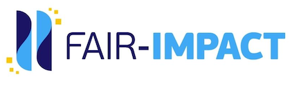

---
# RDA learning materials metadata minimal set
title: "FAIR-by-Design: introducing Skills4EOSC and FAIR-IMPACT"
author: 
    - Sonja Filiposka 
    - Dominique Green
    - Joy Davidson
    - Neil Chue Song
    - Morane Gruenpeter
tags: 
    - FAIR-by-Design
    - FAIR software
    - metadata

abstract: "The main goal of the workshop is to introduce participants to the projects’ resources and show how they can be used to help create a broad range of FAIR by design outputs. We expect this workshop to be of high practical use to participants when it comes to increasing their capacity for supporting the production and reuse of FAIR digital objects. Therefore, it is aimed at any interested stakeholder who would like to become more aware with regards to the FAIR principles in their daily activities by both improving the FAIRness of existing digital objects or employing a FAIR-by-Design approach when developing new digital objects."
primaryLanguage: "EN"
license: "http://creativecommons.org/licenses/by/4.0/"
versionDate: "2024-02-19"
urlToResource: "https://doi.org/10.5072/zenodo.1234567"
resourceURLType: "URL"
targetGroup: "Research software developers, training materials designers"
learningResourceType: "GitBook"
learningOutcome: 
    - describe research software using metadata 
    - describe training materials using metadata
    - assess the FAIRness of software objects
    - follow guidelines for FAIR research software
accessCost: "Y"
expertiseLevel: "Beginner"
---

# IDCC24 W6 - FAIR-by-Design: introducing Skills4EOSC and FAIR-IMPACT 

# Workshop

## Date/Time: Mon, 19 Feb 2024 13:00 - 16:00 GMT

## Location: 
Surgeons Quarter
10 Hill Place Edinburgh EH8 9DS United Kingdom

## Training Description

The main goal of the workshop is to introduce participants to the projects’ resources and show how they can be used to help create a broad range of FAIR by design outputs. We expect this workshop to be of high practical use to participants when it comes to increasing their capacity for supporting the production and reuse of FAIR digital objects. Therefore, it is aimed at any interested stakeholder who would like to become more aware with regards to the FAIR principles in their daily activities by both improving the FAIRness of existing digital objects or employing a FAIR-by-Design approach when developing new digital objects.

## Target audience: Research software developers, training materials designers

## Expertise Level / Skill Level: Beginner

## Primary Language: English

## Access Cost: Y (to follow the workshop in person one must register and pay the conference attendance fee)

## Prerequisites: none

## Duration: 3.5 hrs

## Training objectives

- describe research software using metadata 
- describe training materials using metadata
- assess the FAIRness of software objects
- follow guidelines for FAIR research software

## Keywords

FAIR-by-design, FAIR software, FAIRness, metadata, methodology

## Agenda:

| Time | Topic             |
|-----------|-------------------|
| 13:00 - 13:10  | Introduction   |
| 13:10 - 13.30  | FAIR-IMPACT Metadata fo research software   |
| 13:30 - 13:50  | FAIR-IMPACT FAIR Research Software Metrics      |
| 13:50 - 14:30  | Skills4EOSC FAIR-by-Design Methodology   |
| 14:30 - 14:50  | coffee break       |
| 14:50 - 15:50  | Put it all into practice and measure the FAIRness of your effort   |
| 15:50 - 16:25  | Retrospective: how did it go? - interactive Q&A   |
| 16:25 - 16:30  | Discussion and Conclusions

## Resources and Materials

Official event page: https://www.eventbrite.co.uk/e/idcc24-w6-fair-by-design-introducing-skills4eosc-and-fair-impact-tickets-792998538977
All resource and materials can be found at https://github.com/FAIR-by-Design-Methodology/IDCC24workshop

## Author(s)

Sonja Filiposka, Dominique Green, Joy Davidson, Neil Chue Song, Morane Gruenpeter

# Trainer(s)

Sonja Filiposka, Dominique Green, Joy Davidson, Neil Chue Song, Morane Gruenpeter

## Contact information

sonja.filiposka@finki.ukim.mk

## License

 This work is licensed under a <a rel="license" href="http://creativecommons.org/licenses/by/4.0/">Creative Commons Attribution 4.0 International License</a>.

## DOI

[https://doi.org/10.5072/zenodo.1234567](https://doi.org/10.5072/zenodo.1234567)

## Accessibility Mission

Skills4EOSC is dedicated to ensuring that all produced learning materials are accessible to as many visitors as possible regardless of their ability or technology. We have an active commitment to increasing our learning materials accessibility. The main standards that we aim to comply with are WCAG v.2.1 Level AA criteria and PDF/UA (ISO 14289).

### Acknowledgement

These learning materials have been developed by following the [FAIR-by-Design Methodology](https://doi.org/10.5281/zenodo.7875540).

 